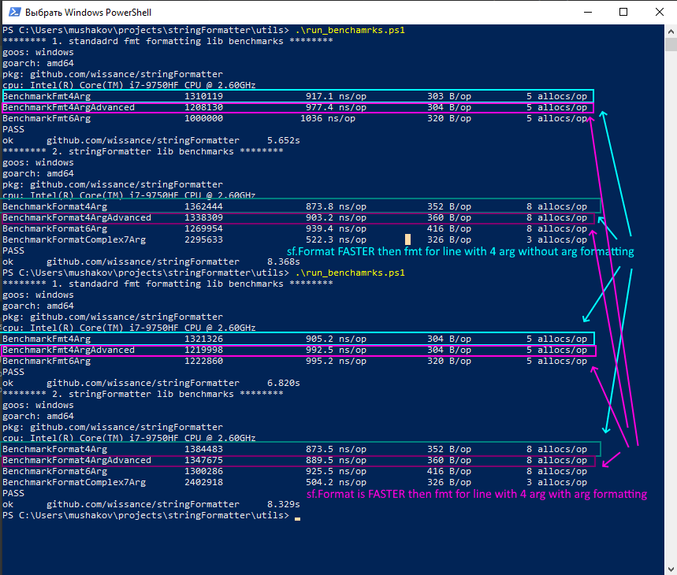

# StringFormatter

A set of a ***high performance string tools*** that helps to build strings from templates and process text faster than with `fmt`!!!.
Slice printing is **50% faster with 8 items** slice and **250% with 20 items** slice 

 
 

 


## 1. Features

1. Text formatting with template using traditional for `C#, Python programmers style` - `{0}`, `{name}` that faster then `fmt` does:

2. Additional text utilities:
   - convert ***map to string*** using one of predefined formats (see `text_utils.go`)
3. Code Style formatting utilities
   - convert `snake`/`kebab`/`camel` programming code to each other and vice versa (see `stringstyle_formatter.go`).

### 1. Text formatting from templates

#### 1.1 Description

This is a GO module for ***template text formatting in syntax like in C# or/and Python*** using:
- `{n}` , n here is a number to notes order of argument list to use i.e. `{0}`, `{1}`
- `{name}` to notes arguments by name i.e. `{name}`, `{last_name}`, `{address}` and so on ...

#### 1.2 Examples

##### 1.2.1 Format by arg order

i.e. you have following template:  `"Hello {0}, we are greeting you here: {1}!"`

if you call Format with args "manager" and "salesApp" :

```go
formattedStr := stringFormatter.Format("Hello {0}, we are greeting you here: {1}!", "manager", "salesApp")
```

you get string `"Hello manager, we are greeting you here: salesApp!"`

##### 1.2.2 Format by arg key

i.e. you have following template: `"Hello {user} what are you doing here {app} ?"`

if you call `FormatComplex` with args `"vpupkin"` and `"mn_console"` `FormatComplex("Hello {user} what are you doing here {app} ?", map[string]any{"user":"vpupkin", "app":"mn_console"})`

you get string `"Hello vpupkin what are you doing here mn_console ?"`

another example is:

```go
strFormatResult = stringFormatter.FormatComplex(
	"Current app settings are: ipAddr: {ipaddr}, port: {port}, use ssl: {ssl}.", 
	map[string]any{"ipaddr":"127.0.0.1", "port":5432, "ssl":false},
)
```
a result will be: `"Current app settings are: ipAddr: 127.0.0.1, port: 5432, use ssl: false."``

##### 1.2.3 Advanced arguments formatting

For more convenient lines formatting we should choose how arguments are representing in output text, 
`stringFormatter` supports following format options:
1. Bin number formatting 
   - `{0:B}, 15 outputs -> 1111`
   - `{0:B8}, 15 outputs -> 00001111`
2. Hex number formatting
   - `{0:X}, 250 outputs -> fa`
   - `{0:X4}, 250 outputs -> 00fa`
3. Oct number formatting
   - `{0:o}, 11 outputs -> 14`
4. Float point number formatting
   - `{0:E2}, 191.0478 outputs -> 1.91e+02`
   - `{0:F}, 10.4567890 outputs -> 10.456789`
   - `{0:F4}, 10.4567890 outputs -> 10.4568`
   - `{0:F8}, 10.4567890 outputs -> 10.45678900`
5. Percentage output
   - `{0:P100}, 12 outputs -> 12%`
6. Lists
   - `{0:L-}, [1,2,3] outputs -> 1-2-3`
   - `{0:L, }, [1,2,3] outputs -> 1, 2, 3`
7. Code
   - `{0:c:snake}, myFunc outputs -> my_func`
   - `{0:c:Snake}, myFunc outputs -> My_func`
   - `{0:c:SNAKE}, read-timeout outputs -> READ_TIMEOUT`
   - `{0:c:camel}, my_variable outputs -> myVariable`
   - `{0:c:Camel}, my_variable outputs -> MyVariable`

##### 1.2.4 Benchmarks of the Format and FormatComplex functions

benchmark could be running using following commands from command line:
* to see `Format` result - `go test -bench=Format -benchmem -cpu 1`
* to see `fmt` result - `go test -bench=Fmt -benchmem -cpu 1`

### 2. Text utilities

#### 2.1 Map to string utility

`MapToString` function allows to convert map with primitive key to string using format, including key and value, e.g.:
* `{key} => {value}`
* `{key} : {value}`
* `{value}`

For example:
```go
options := map[string]any{
	"connectTimeout": 1000,
	"useSsl":         true,
	"login":          "sa",
	"password":       "sa",
}

str := stringFormatter.MapToString(&options, "{key} : {value}", ", ")
// NOTE: order of key-value pairs is not guranteed though
// str will be something like:
"connectTimeout : 1000, useSsl : true, login : sa, password : sa"
```

#### 2.2 Benchmarks of the MapToString function

* to see `MapToStr` result - `go test -bench=MapToStr -benchmem -cpu 1`


#### 2.3 Slice to string utility

`SliceToString` - function that converts slice with passed separation between items to string.
```go
slice := []any{100, "200", 300, "400", 500, 600, "700", 800, 1.09, "hello"}
separator := ","
result := stringFormatter.SliceToString(&slice, &separator)
```

`SliceSameTypeToString` - function that converts typed slice to line with separator
```go
separator := ":"
numericSlice := []int{100, 200, 400, 800}
result := stringFormatter.SliceSameTypeToString(&numericSlice, &separator)
```

#### 2.4 Benchmarks of the SliceToString function

`sf` is rather fast then `fmt` 2.5 times (250%) faster on slice with 20 items, see benchmark:


### 3. Contributors

<a href="https://github.com/Wissance/stringFormatter/graphs/contributors">
  
</a>
