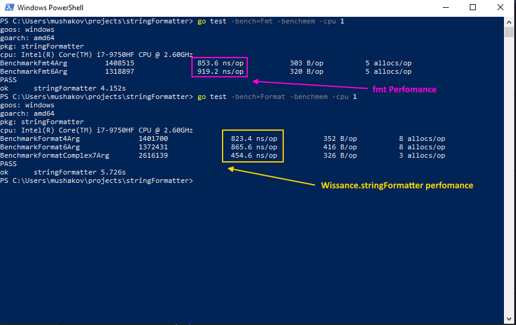
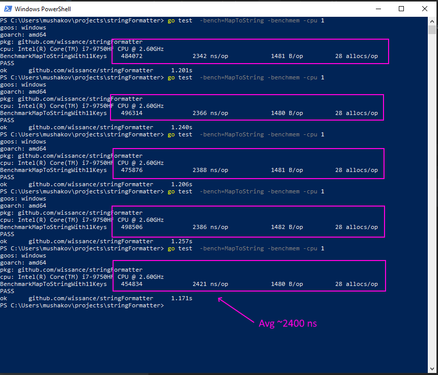
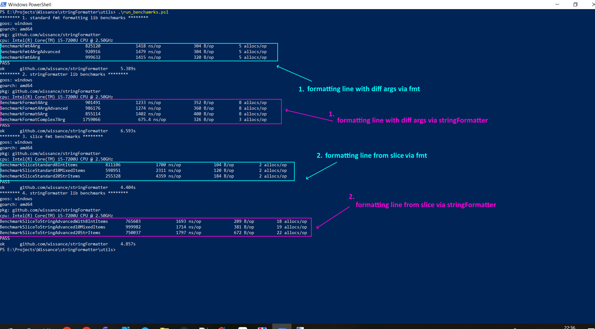

# Wissance/StringFormatter
 
 

 
[](https://github.com/Wissance/stringFormatter/actions/workflows/ci.yml)
[](https://goreportcard.com/report/github.com/wissance/stringFormatter)


`StringFormatter` is a ***high-performance*** Go library for string (text) formatting. It offers a syntax *familiar* to `C#`, `Java` and `Python` developers (via template arguments - `{0}` (positional), `{name}` (named)), extensive argument formatting options (numbers, lists, code style), and a set of text utilities — all while being significantly fast as the standard `fmt` package and even more! Typical usage of `sf` are:
1. Create `e-mails`, `Messages` (`SMS`, `Telegram`, other `Notifications`) or other complicated text **based on templates**
2. Create a complicated log text with specific argument formatting
3. Use for **template-based src code generator**
4. Other text proccessing

Other important resources: 
* [Go Report Card A+](https://goreportcard.com/report/github.com/wissance/stringFormatter)
* [Coverage > 80%](https://coveralls.io/github/Wissance/stringFormatter)


## ✨ 1 Features

🔤 Flexible Syntax: Supports both indexed / positional (`{0}`) and named (`{user}`) *placeholders* in templates.

🎨 Advanced Formatting: Built-in directives for numbers (`HEX`, `BIN`), `floats`, `lists`, and code styles (camelCase, SNAKE_CASE).

🚀 Performance: Template formatting and slice conversion are even faster then `fmt`.

🛠 Utilities: Functions to convert `maps` and `slices` into strings with custom separators and formats.

:man_technologist: Safe : `StringFormatter` aka `sf` **is safe** (`SAST` and tests are running automatically on push) 

## 📦 2 Installation

```bash
go get github.com/Wissance/stringFormatter
```

## 🚀 3  Usage

### 3.1 Template Formatting

#### 3.1.1 By Argument Order (Format)
The Format function replaces `{n}` placeholders with the corresponding argument in the provided order.

```go
package main

import (
    "fmt"
    sf "github.com/Wissance/stringFormatter"
)

func main() {
    template := "Hello, {0}! Your balance is {1} USD."
    result := sf.Format(template, "Alex", 2500)
    fmt.Println(result)
    // Output: Hello, Alex! Your balance is 2500 USD.
}
```

#### 3.1.2 By Argument Name (FormatComplex)
The FormatComplex function uses a `map[string]any` to replace named placeholders like `{key}`.

```go
package main

import (
    "fmt"
    sf "github.com/Wissance/stringFormatter"
)

func main() {
    template := "User {user} (ID: {id}) logged into {app}."
    args := map[string]any{
        "user": "john_doe",
        "id":   12345,
        "app":  "dashboard",
    }
    result := sf.FormatComplex(template, args)
    fmt.Println(result)
    // Output: User john_doe (ID: 12345) logged into dashboard.
}
```

### 3.2 Advanced Argument Formatting
You can control how arguments are displayed by adding a colon (:) and a format specifier to the placeholder.

| Type | Specifier | Description | Example Template | Example Value | Output |
| :--- | :--- | :--- | :--- | :--- | :--- |
| **Numbers** | `:B` | Binary (without padding) | `"{0:B}"` | `15` | `1111` |
| | `:B8` | Binary with 8-digit padding | `"{0:B8}"` | `15` | `00001111` |
| | `:X` | Hexadecimal (lowercase) | `"{0:X}"` | `250` | `fa` |
| | `:X4` | Hexadecimal with 4-digit padding | `"{0:X4}"` | `250` | `00fa` |
| | `:o` | Octal | `"{0:o}"` | `11` | `14` |
| **Floating Point** | `:F` | Default float format | `"{0:F}"` | `10.4567890` | `10.456789` |
| | `:F2` | Float with 2 decimal places | `"{0:F2}"` | `10.4567890` | `10.46` |
| | `:F4` | Float with 4 decimal places | `"{0:F4}"` | `10.4567890` | `10.4568` |
| | `:F8` | Float with 8 decimal places | `"{0:F8}"` | `10.4567890` | `10.45678900` |
| | `:E2` | Scientific notation | `"{0:E2}"` | `191.0478` | `1.91e+02` |
| **Percentage** | `:P100` | Percentage (multiply by 100) | `"{0:P100}"` | `12` | `12%` |
| **Lists (Slices)** | `:L-` | Join with hyphen | `"{0:L-}"` | `[1 2 3]` | `1-2-3` |
| | `:L, ` | Join with comma and space | `"{0:L, }"` | `[1 2 3]` | `1, 2, 3` |
| **Code Styles** | `:c:snake` | Convert to snake_case | `"{0:c:snake}"` | `myFunc` | `my_func` |
| | `:c:Snake` | Convert to Snake_Case (PascalSnake) | `"{0:c:Snake}"` | `myFunc` | `My_Func` |
| | `:c:SNAKE` | Convert to SNAKE_CASE (upper) | `"{0:c:SNAKE}"` | `read-timeout` | `READ_TIMEOUT` |
| | `:c:camel` | Convert to camelCase | `"{0:c:camel}"` | `my_variable` | `myVariable` |
| | `:c:Camel` | Convert to CamelCase (PascalCase) | `"{0:c:Camel}"` | `my_variable` | `MyVariable` |
| | `:c:kebab` | Convert to kebab-case | `"{0:c:kebab}"` | `myVariable` | `my-variable` |
| | `:c:Kebab` | Convert to Kebab-Case (PascalKebab) | `"{0:c:Kebab}"` | `myVariable` | `My-Variable` |
| | `:c:KEBAB` | Convert to KEBAB-CASE (upper) | `"{0:c:KEBAB}"` | `myVariable` | `MY-VARIABLE` |

```go
package main

import (
    "fmt"
    sf "github.com/Wissance/stringFormatter"
)

func main() {
    template := "Status 0x{0:X4} (binary: {0:B8}), temp: {1:F1}°C, items: {2:L, }."
    result := sf.Format(template, 475, 23.876, []int{1, 2, 3})
    fmt.Println(result)
    // Output: Status 0x01DB (binary: 00011101), temp: 23.9°C, items: 1, 2, 3.
}
```

## 🛠 4 Text Utilities

### 4.1 Map to String (MapToString)
Converts a map with primitive keys to a formatted string.
```go
options := map[string]any{
    "host": "localhost",
    "port": 8080,
    "ssl":  true,
}

str := sf.MapToString(&options, "{key} = {value}", "\n")
// Possible output (key order is not guaranteed):
// host = localhost
// port = 8080
// ssl = true
```

### 4.2 Slice to String (SliceToString, SliceSameTypeToString)
Converts slices to a string using a specified separator.

```go
// For a slice of any type
mixedSlice := []any{100, "text", 3.14}
separator := " | "
result1 := sf.SliceToString(&mixedSlice, &separator)
// result1: "100 | text | 3.14"

// For a typed slice
numSlice := []int{10, 20, 30}
result2 := sf.SliceSameTypeToString(&numSlice, &separator)
// result2: "10 | 20 | 30"
```

## 📊 5 Benchmarks
The library is optimized for high-load scenarios. Key benchmarks show significant performance gains (performance could be differ due to 1. different CPU architectures 2. statistics):

Formatting (Format) vs fmt.Sprintf: 3-5x faster for complex templates.
Slices (SliceToString) vs manual fmt-based joining: from `2.5` faster up to 20 items.

Run the benchmarks yourself:
```bash
go test -bench=Format -benchmem -cpu 1
go test -bench=Fmt -benchmem -cpu 1
go test -bench=MapToStr -benchmem -cpu 1
```
Some benchmark screenshots:

1. `Format` and `FormatComplex`:


2. `MapToStr`:


3. `SliceToStr`:


## 📄 6 License
This project is licensed under the MIT License - see the LICENSE file for details.

## 🤝 7 Contributing
Contributions are welcome! If you find a bug or have a feature suggestion, please open an issue or submit a pull request.

**Contributors:**

<a href="https://github.com/Wissance/stringFormatter/graphs/contributors">
  
</a>
